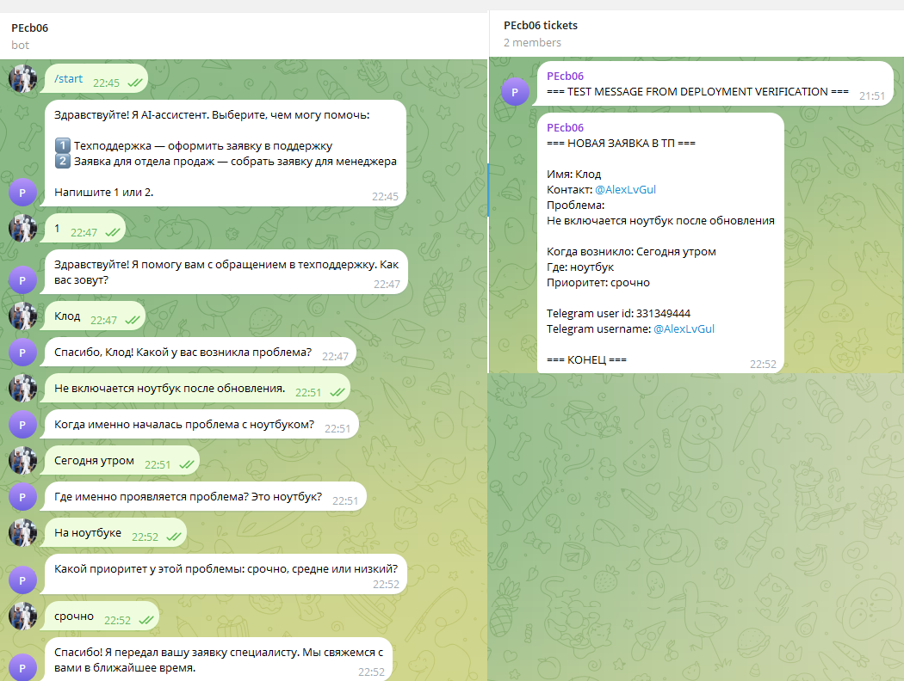
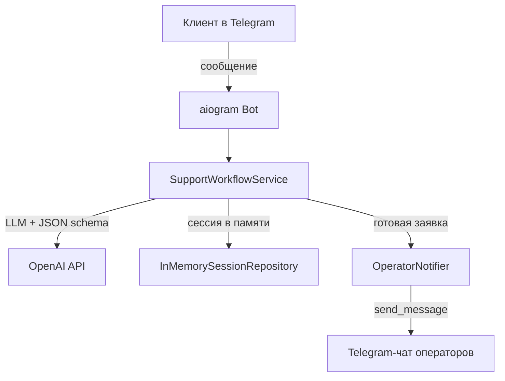

# 🤖 Telegram Intake Bot

⚡ **Автоматизируйте первичный сбор заявок и лидов в Telegram: клиент пишет свободным текстом, а менеджер получает структурированную заявку.**

Telegram-бот, который ведёт короткий естественный диалог, извлекает данные с помощью LLM и отправляет готовую заявку в чат техподдержки или отдела продаж. Подходит для небольших команд, которым нужно превратить входящие сообщения в чёткие задачи без форм и звонков.

- Клиент пишет «У меня сломался ноутбук» — бот уточнит имя, контакт, время, место, приоритет и передаст заявку в ТП.
- Потенциальный покупатель просит «автоматизацию продаж» — бот соберёт компанию, бюджет, сроки, квалифицирует лид и отправит менеджеру.

[🎬 Как это работает](docs/SYSTEM_DEMO.md) · [💼 Бизнес-ценность](docs/BUSINESS_VALUE.md) · [🚀 Развёртывание](docs/DEPLOYMENT_GUIDE.md)

> 📌 **Атрибуция:** идея и первоначальная структура проекта взяты из репозитория [`MrGAN12009/incoming_lids`](https://github.com/MrGAN12009/incoming_lids). Текущая версия расширена вторым сценарием (сбор лидов), переработана документация и подготовлена к публичному портфолио.

---

## ▶️ Демо

> 🎬 Посмотрите примеры реальных диалогов и результатов в [`docs/SYSTEM_DEMO.md`](docs/SYSTEM_DEMO.md).



Скриншоты и сквозные сценарии — в [`docs/SYSTEM_DEMO.md`](docs/SYSTEM_DEMO.md) и [`docs/E2E_SCENARIOS.md`](docs/E2E_SCENARIOS.md).

---

## ❓ Зачем нужен Telegram Intake Bot

Малые команды техподдержки и отделы продаж ежедневно получают входящие сообщения в Telegram:

- данные приходят в свободной форме и теряются в переписке;
- менеджер вручную выясняет, чем может помочь клиент;
- заявки из ТП и продаж перемешиваются в одном чате;
- нет единого формата для передачи между сотрудниками.

**Telegram Intake Bot решает эту проблему:** клиент ведёт естественный диалог, а команда получает структурированную заявку или квалифицированный лид в отдельный Telegram-чат.

Больше о бизнес-ценности — в [`docs/BUSINESS_VALUE.md`](docs/BUSINESS_VALUE.md).

---

## 🎯 Для кого

- Малые команды техподдержки.
- Отделы продаж, принимающие заявки через Telegram.
- Агентства и интеграторы, которым нужен быстрый MVP сбора данных.
- Проекты, где важно превратить переписку в структурированные задачи.

---

## ✨ Ключевые возможности

- **Два сценария в одном боте** — техподдержка и сбор лидов с выбором при старте.
- **Естественный диалог** — клиент отвечает свободным текстом, бот уточняет недостающее.
- **Извлечение данных через LLM** — OpenAI API с JSON Schema и Pydantic-валидацией.
- **Детерминированные guard replies** — если LLM пропускает обязательное поле, бот задаёт чёткий уточняющий вопрос.
- **Квалификация лидов** — статус `горячий` / `теплый` / `холодный` определяется автоматически по срокам и бюджету.
- **Готовая заявка в чат** — оператор или менеджер получает структурированное сообщение.
- **Сброс диалога** — команда `/reset` возвращает клиента к выбору сценария.
- **Docker-контейнеризация** — простое развёртывание на VPS.

---

## 🏗️ Краткий обзор архитектуры



- **aiogram 3.x** — получение сообщений и отправка ответов через Telegram Bot API.
- **SupportWorkflowService** — оркестрация диалога, guard replies, отправка заявки.
- **OpenAISupportAssistant** — вызов OpenAI API с JSON Schema.
- **InMemorySessionRepository** — хранение состояния диалога в памяти процесса (MVP).
- **OperatorNotifier** — форматирование и отправка заявки в чат операторов.

Подробнее — в [`docs/ARCHITECTURE.md`](docs/ARCHITECTURE.md).

---

## 🛠️ Технологический стек

| Компонент | Технология |
|-----------|------------|
| Язык | Python 3.12 |
| Telegram | aiogram 3.x |
| HTTP-клиент | httpx |
| LLM | OpenAI API (`gpt-4.1-mini` по умолчанию) |
| Валидация | pydantic + pydantic-settings |
| Контейнеризация | Docker |

---

## 🚀 Быстрый старт

### 1. Переменные окружения

Скопируй `.env.example` в `.env` и заполни:

```bash
cp .env.example .env
```

```env
TELEGRAM_BOT_TOKEN=your_telegram_bot_token
OPERATOR_CHAT_ID=-1001234567890
OPENAI_API_KEY=your_openai_api_key
OPENAI_MODEL=gpt-4.1-mini
OPENAI_BASE_URL=https://api.openai.com/v1
LOG_LEVEL=INFO
```

- `TELEGRAM_BOT_TOKEN` — получается у [@BotFather](https://t.me/botfather).
- `OPERATOR_CHAT_ID` — ID группы или канала, куда бот будет отправлять заявки. Бот должен быть в этой группе и иметь право отправлять сообщения.

### 2. Сборка и запуск

```bash
docker build -t telegram-intake-bot .
docker run -d --name telegram-intake-bot --env-file .env --restart unless-stopped telegram-intake-bot
```

### 3. Проверка

- Напишите боту `/start`.
- Выберите сценарий: `1` (техподдержка) или `2` (заявка для продаж).
- Пройдите диалог до финального сообщения.
- Убедитесь, что заявка пришла в указанный чат.

Полная инструкция по развёртыванию — в [🚀 `docs/DEPLOYMENT_GUIDE.md`](docs/DEPLOYMENT_GUIDE.md).

---

## 📚 Документация

### Для заказчиков и менеджеров

| Документ | Описание |
|----------|----------|
| [💼 `docs/BUSINESS_VALUE.md`](docs/BUSINESS_VALUE.md) | Бизнес-проблема, решение, эффект, выгода |
| [🎬 `docs/SYSTEM_DEMO.md`](docs/SYSTEM_DEMO.md) | Скриншоты, диалоги, бизнес-сценарии |
| [🎬 `docs/E2E_SCENARIOS.md`](docs/E2E_SCENARIOS.md) | Сквозные сценарии и чек-лист скриншотов |

### Для пользователей и операторов

| Документ | Описание |
|----------|----------|
| [📖 `docs/USER_GUIDE.md`](docs/USER_GUIDE.md) | Как пользоваться ботом клиенту |
| [🎛️ `docs/OPERATOR_GUIDE.md`](docs/OPERATOR_GUIDE.md) | Как работать с заявками в чате операторов |

### Для инженеров и интеграторов

| Документ | Описание |
|----------|----------|
| [🏗️ `docs/ARCHITECTURE.md`](docs/ARCHITECTURE.md) | Архитектура, компоненты, поток данных |
| [📋 `docs/IMPLEMENTATION_PLAN.md`](docs/IMPLEMENTATION_PLAN.md) | Технический план и критерии готовности |
| [🔌 `docs/API_CONTRACT.md`](docs/API_CONTRACT.md) | Контракты с Telegram Bot API и OpenAI API |
| [📝 `docs/PROMPT_ARCHITECTURE.md`](docs/PROMPT_ARCHITECTURE.md) | Архитектура промптов и JSON Schema |
| [🧪 `docs/TESTING.md`](docs/TESTING.md) | Стратегия тестирования и результаты E2E-прогонов |
| [🚀 `docs/DEPLOYMENT_GUIDE.md`](docs/DEPLOYMENT_GUIDE.md) | Развёртывание на VPS |
| [🔐 `docs/SECURITY_NOTES.md`](docs/SECURITY_NOTES.md) | Рекомендации по безопасности |
| [📊 `docs/PROJECT_STATE.md`](docs/PROJECT_STATE.md) | Паспорт состояния проекта и бэклог |

---

## 📁 Структура проекта

```text
telegram-intake-bot/
├── README.md                      # Точка входа в проект
├── docs/                            # Публичная документация
│   ├── BUSINESS_VALUE.md            # Бизнес-ценность
│   ├── SYSTEM_DEMO.md               # Скриншоты и демо-сценарии
│   ├── E2E_SCENARIOS.md             # Сквозные сценарии
│   ├── USER_GUIDE.md                # Руководство клиента
│   ├── OPERATOR_GUIDE.md            # Руководство оператора
│   ├── ARCHITECTURE.md              # Архитектура системы
│   ├── IMPLEMENTATION_PLAN.md       # Технический план
│   ├── API_CONTRACT.md              # Контракты внешних API
│   ├── DEPLOYMENT_GUIDE.md          # Развёртывание
│   ├── PROMPT_ARCHITECTURE.md       # Архитектура промптов
│   ├── TESTING.md                   # Результаты тестирования
│   ├── PROJECT_STATE.md             # Паспорт состояния проекта
│   ├── SECURITY_NOTES.md            # Рекомендации по безопасности
│   ├── screenshots/                 # Иллюстрации и скриншоты
│   └── examples/                    # Примеры JSON и сообщений
├── bot/                             # Telegram-обработчики
│   ├── handlers/
│   │   └── support.py
│   ├── utils/
│   │   └── formatter.py
│   └── main.py
├── core/                            # Конфигурация и схемы
│   ├── config.py
│   ├── logging.py
│   └── schemas.py
├── services/                        # Бизнес-логика
│   ├── assistant/                   # OpenAI-ассистент и промпты
│   │   ├── openai_support_assistant.py
│   │   └── prompts.py
│   ├── storage/                     # In-memory сессии
│   │   └── session_repository.py
│   ├── telegram/                    # Отправка заявок в чат
│   │   └── operator_notifier.py
│   └── workflow.py                  # Оркестрация диалога
├── prompts/                         # Версионированные промпты
│   ├── support-assistant-v1.md
│   ├── support-assistant-v2.md
│   ├── sales-lead-assistant-v1.md
│   └── sales-lead-assistant-v2.md
├── tests/                           # Pytest-тесты
│   ├── test_models.py
│   └── test_scenarios.py
├── main.py                          # Точка входа для Docker
├── Dockerfile                       # Сборка образа
├── requirements.txt                 # Python-зависимости
└── .env.example                     # Шаблон переменных окружения
```

---

## ✅ Статус проекта

Реализованы оба сценария (техподдержка и сбор лидов), версионированные промпты, guard replies, Docker-контейнеризация и документация для публичного портфолио.

`pytest`: все тесты пройдены. Ручной E2E-прогон v2 — 3/3 PASS.

Текущее состояние и следующий шаг — в [📊 `docs/PROJECT_STATE.md`](docs/PROJECT_STATE.md).

---

## ⚠️ Ограничения

- Сессии хранятся в памяти процесса. После перезапуска бота история сбрасывается.
- Для продакшена рекомендуется добавить постоянное хранилище, retry/backoff, аудит сообщений и health endpoint.

---

## 📄 Лицензия

MIT
