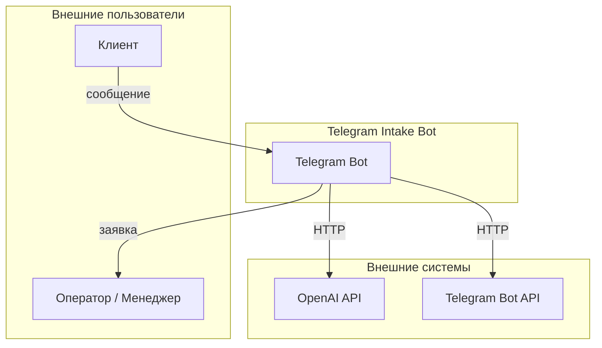
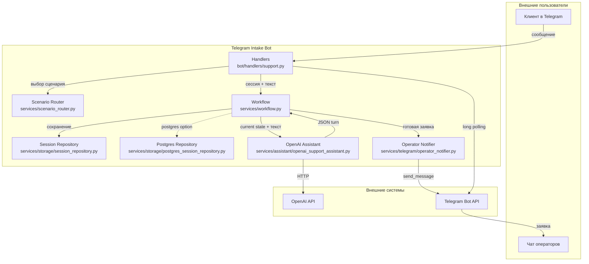

# 🏗️ Telegram Intake Bot · ARCHITECTURE

**Проект:** telegram-intake-bot  
**Дата:** 2026-08-09  
**Статус:** as-built

---

## 🎯 1. Архитектурные принципы

Telegram Intake Bot — MVP Telegram-бота для первичной обработки входящих заявок.

Ключевые принципы:

- **Один диалоговый движок** для двух сценариев: техподдержка и сбор лидов.
- **LLM отвечает за понимание естественного языка**, а **детерминированные guard replies** — за порядок и полноту сбора полей.
- **Промпты версионированы и вынесены из кода** в `prompts/`; активная версия фиксируется в `docs/PROMPT_ARCHITECTURE.md`.
- **JSON Schema ответа LLM** — строгая структура `AssistantTurn`, валидируемая Pydantic.
- **Fallback на username** — Telegram username используется как контакт только перед отправкой заявки, а не в начале диалога.
- **Сессии в памяти** по умолчанию; PostgreSQL-адаптер готов к продакшену через `SESSION_STORAGE_TYPE=postgres`.

---

## 🌐 2. Context Diagram

---

## 📦 3. Container Diagram

---

## 🧩 4. Состав компонентов

| Компонент | Файл | Назначение |
|-----------|------|------------|
| Точка входа | `main.py` | Запуск бота |
| Обработчики | `bot/handlers/support.py` | `/start`, `/reset`, выбор сценария, текстовые сообщения |
| Конфигурация | `core/config.py` | Pydantic-settings из `.env` |
| Схемы данных | `core/schemas.py` | `SupportTicket`, `SalesLead`, `SupportSession`, `AssistantTurn` |
| LLM-ассистент | `services/assistant/openai_support_assistant.py` | HTTP-запросы к OpenAI с JSON Schema и fallback-логикой |
| Промпты | `services/assistant/prompts.py` | Загрузка system prompts и response schema для обоих сценариев |
| Scenario Router | `services/scenario_router.py` | Конфигурируемый выбор сценария по тексту пользователя |
| Workflow | `services/workflow.py` | Оркестрация диалога, guard replies, отправка заявки |
| Уведомления | `services/telegram/operator_notifier.py` | Отправка заявки в чат операторов |
| Хранилище (in-memory) | `services/storage/session_repository.py` | In-memory сессии (default) |
| Хранилище (PostgreSQL) | `services/storage/postgres_session_repository.py` | PostgreSQL persistence через `SESSION_STORAGE_TYPE=postgres` |
| Контракт хранилища | `services/storage/base.py` | `SessionRepositoryProtocol` |

---

## 🔄 5. Поток данных

### 5.1. Выбор сценария

- Пользователь отправляет `/start`.
- Бот присылает меню выбора через `ScenarioRouter.selection_message()`.
- `ScenarioRouter.resolve(message_text)` сопоставляет ввод с известными синонимами.
- Выбор сохраняется в `SupportSession.scenario`.
- Новый сценарий добавляется одной строкой в реестре `ScenarioRouter`.

### 5.2. Сбор данных

- Каждое текстовое сообщение передаётся в `SupportWorkflowService.process_message`.
- Workflow вызывает `OpenAISupportAssistant.generate_turn` с текущим состоянием сценария.
- LLM возвращает JSON с полями `reply`, `extracted_ticket`, `extracted_lead`, `ready_to_submit`.
- Данные из `extracted_ticket` или `extracted_lead` мержатся в сессию.

### 5.3. Отправка заявки

- Когда все обязательные поля заполнены, workflow вызывает `OperatorNotifier.send`.
- Notifier формирует сообщение в зависимости от сценария и отправляет его в `OPERATOR_CHAT_ID`.

---

## 📐 6. Модели данных

### `SupportSession`

| Поле | Тип | Описание |
|------|-----|----------|
| `user_id` | `int` | ID пользователя Telegram |
| `chat_id` | `int` | ID чата |
| `telegram_username` | `str \| None` | Username пользователя |
| `telegram_first_name` | `str \| None` | Имя из профиля Telegram |
| `scenario` | `"support" \| "sales_lead" \| None` | Выбранный сценарий |
| `started` | `bool` | Флаг начала диалога |
| `submitted` | `bool` | Флаг отправки заявки |
| `ticket` | `SupportTicket` | Текущая заявка в ТП |
| `lead` | `SalesLead` | Текущий лид |
| `history` | `list[DialogueMessage]` | История диалога (до 20 сообщений) |

### `SupportTicket`

| Поле | Тип | Описание |
|------|-----|----------|
| `name` | `str \| None` | Имя клиента |
| `contact` | `str \| None` | Телефон или Telegram |
| `problem_summary` | `str \| None` | Описание проблемы |
| `occurred_at` | `str \| None` | Когда возникла проблема |
| `location` | `str \| None` | Где проявляется проблема |
| `priority` | `Literal` | `срочно`, `средне`, `низкий приоритет` |

### `SalesLead`

| Поле | Тип | Описание |
|------|-----|----------|
| `name` | `str \| None` | Имя клиента |
| `contact` | `str \| None` | Телефон или Telegram |
| `company` | `str \| None` | Компания или ИП |
| `service_interest` | `str \| None` | Интересующая услуга/продукт |
| `budget_range` | `str \| None` | Бюджет или диапазон |
| `timeframe` | `str \| None` | Сроки начала |
| `status` | `Literal` | `горячий`, `теплый`, `холодный` |

---

## 🛡️ 7. Fallback-логика

Если вызов OpenAI API не удался, срабатывает локальная логика:

- определение запрашиваемого поля по последнему сообщению бота;
- извлечение имени, контакта, приоритета/статуса, времени, места и т.д. через regex;
- построение следующего вопроса по недостающим полям.

Fallback не пытается заменить LLM полностью, но позволяет не обрывать диалог при временных проблемах с API.

---

## 🚨 8. Исключения и обработка ошибок

- Все исключения в `handle_text_message` логируются и скрываются от пользователя общим сообщением.
- HTTP-ошибки от OpenAI ретраются до 3 попыток для статусов `408, 409, 429, 500, 502, 503, 504`.
- Неподдерживаемые типы сообщений (голосовые, файлы) получают просьбу ответить текстом.

---

## ⚠️ 9. Ограничения и следующие шаги

- In-memory сессии используются по умолчанию. PostgreSQL-адаптер готов; для включения задайте `SESSION_STORAGE_TYPE=postgres` и `DATABASE_URL`.
- Нет аудита всех сообщений и ошибок в постоянное хранилище.
- Для production стоит добавить health endpoint, мониторинг и graceful shutdown.

---

## 📚 Связанные документы

- [🏠 `README.md`](../README.md) — главная страница проекта.
- [🔌 `docs/API_CONTRACT.md`](API_CONTRACT.md) — контракты с Telegram Bot API и OpenAI API.
- [📝 `docs/PROMPT_ARCHITECTURE.md`](PROMPT_ARCHITECTURE.md) — архитектура промптов и JSON Schema.
- [🧪 `docs/TESTING.md`](TESTING.md) — результаты E2E-прогонов.
- [🚀 `docs/DEPLOYMENT_GUIDE.md`](DEPLOYMENT_GUIDE.md) — развёртывание с нуля.
- [📋 `docs/IMPLEMENTATION_PLAN.md`](IMPLEMENTATION_PLAN.md) — план реализации.
- [📊 `docs/PROJECT_STATE.md`](PROJECT_STATE.md) — паспорт состояния проекта.
