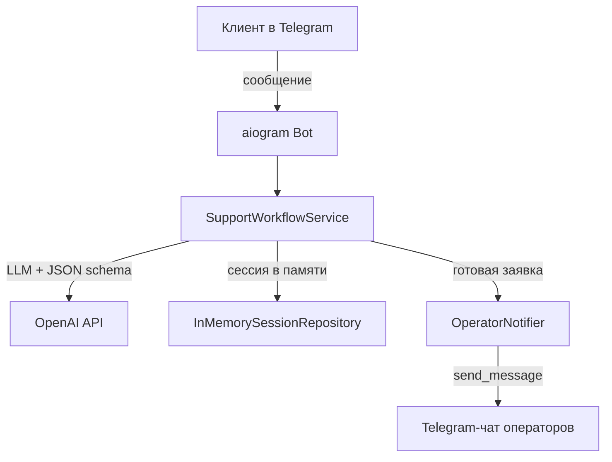

# 📋 Telegram Intake Bot · IMPLEMENTATION_PLAN

**Проект:** telegram-intake-bot  
**Дата:** 2026-08-09  
**Статус:** as-built

---

## 🎯 1. Архитектура решения

---

## 🧩 2. Состав компонентов

| Компонент | Файл | Назначение |
|-----------|------|------------|
| Точка входа | `main.py` | Запуск бота |
| Обработчики | `bot/handlers/support.py` | `/start`, `/reset`, выбор сценария, текстовые сообщения |
| Конфигурация | `core/config.py` | Pydantic-settings из `.env` |
| Схемы | `core/schemas.py` | `SupportTicket`, `SalesLead`, `SupportSession`, `AssistantTurn` |
| LLM-ассистент | `services/assistant/openai_support_assistant.py` | HTTP-запросы к OpenAI с JSON Schema и fallback-логикой |
| Промпт | `services/assistant/prompts.py` | Загрузка system prompts и response schema для обоих сценариев |
| Workflow | `services/workflow.py` | Выбор сценария, оркестрация диалога, guard replies, отправка заявки |
| Уведомления | `services/telegram/operator_notifier.py` | Отправка заявки в чат операторов |
| Хранилище | `services/storage/session_repository.py` | In-memory сессии |

---

## 📐 3. Модель данных

### 3.1. SupportTicket

| Поле | Тип | Описание |
|------|-----|----------|
| `name` | `str \| None` | Имя клиента |
| `contact` | `str \| None` | Телефон или Telegram |
| `problem_summary` | `str \| None` | Описание проблемы |
| `occurred_at` | `str \| None` | Когда возникла проблема |
| `location` | `str \| None` | Где проявляется проблема |
| `priority` | `"срочно" \| "средне" \| "низкий приоритет" \| None` | Приоритет |

### 3.2. SalesLead

| Поле | Тип | Описание |
|------|-----|----------|
| `name` | `str \| None` | Имя клиента |
| `contact` | `str \| None` | Телефон или Telegram |
| `company` | `str \| None` | Компания или ИП |
| `service_interest` | `str \| None` | Интересующая услуга/продукт |
| `budget_range` | `str \| None` | Бюджет или диапазон |
| `timeframe` | `str \| None` | Сроки начала |
| `status` | `"горячий" \| "теплый" \| "холодный" \| None` | Квалификация лида |

### 3.3. SupportSession

| Поле | Описание |
|------|----------|
| `user_id` | ID пользователя Telegram |
| `chat_id` | ID чата |
| `telegram_username` | Username пользователя |
| `telegram_first_name` | Имя пользователя |
| `scenario` | Выбранный сценарий: `support` или `sales_lead` |
| `started` | Флаг начала диалога |
| `submitted` | Флаг отправки заявки |
| `ticket` | Текущее состояние заявки в ТП |
| `lead` | Текущий лид |
| `history` | История диалога (до 20 сообщений) |

---

## 🔌 4. Интеграции

| Система | Тип | Данные |
|---------|-----|--------|
| Telegram Bot API | HTTP long polling | Входящие сообщения и ответы |
| OpenAI API | HTTP JSON | Генерация ответа и извлечение полей |
| Telegram-чат операторов | `send_message` | Готовая заявка |

---

## 📅 5. План реализации

### 5.1. Этап 1 · Подготовка окружения

- Создать `.env` на основе `.env.example`.
- Получить `TELEGRAM_BOT_TOKEN` через [@BotFather](https://t.me/botfather).
- Создать группу/канал для операторов и получить `OPERATOR_CHAT_ID`.
- Подготовить `OPENAI_API_KEY`.

### 5.2. Этап 2 · Локальная проверка

- Установить зависимости.
- Запустить `python main.py` или собрать Docker-образ.
- Пройти оба сценария до отправки заявки в чат операторов.

### 5.3. Этап 3 · Сборка Docker-образа

- `docker build -t telegram-intake-bot .`
- Проверить запуск контейнера локально.

### 5.4. Этап 4 · Развёртывание на VPS

- Подключиться к VPS по SSH.
- Установить Docker.
- Склонировать репозиторий и настроить `.env`.
- Запустить контейнер в фоне.
- Проверить работу через Telegram.

### 5.5. Этап 5 · Подготовка документации

- README.md, ARCHITECTURE.md, API_CONTRACT.md.
- DEPLOYMENT_GUIDE.md, USER_GUIDE.md, OPERATOR_GUIDE.md.
- E2E_SCENARIOS.md, BUSINESS_VALUE.md, SECURITY_NOTES.md.
- MEDIA_INDEX.md + скриншоты.

---

## ✅ 6. Критерии готовности

- [x] Бот отвечает на `/start` меню выбора сценария.
- [x] Бот корректно обрабатывает выбор `1` и `2`.
- [x] Бот собирает все поля заявки в техподдержку.
- [x] Бот собирает все обязательные поля лида.
- [x] Бот квалифицирует лид статусом `горячий` / `теплый` / `холодный`.
- [x] Готовая заявка отправляется в указанный `OPERATOR_CHAT_ID`.
- [x] Команда `/reset` сбрасывает диалог и возвращает к выбору сценария.
- [x] Docker-образ собирается без ошибок.
- [x] Контейнер стабильно работает в фоновом режиме.
- [x] Логи показывают корректную обработку сообщений.
- [ ] Deployment Validation пройден на VPS.

---

## 📚 Связанные документы

- [🏠 `README.md`](../README.md) — главная страница проекта.
- [🏗️ `docs/ARCHITECTURE.md`](ARCHITECTURE.md) — архитектурные решения.
- [🚀 `docs/DEPLOYMENT_GUIDE.md`](DEPLOYMENT_GUIDE.md) — развёртывание с нуля.
- [🧪 `docs/TESTING.md`](TESTING.md) — результаты проверки.
- [📊 `docs/PROJECT_STATE.md`](PROJECT_STATE.md) — паспорт состояния проекта.
