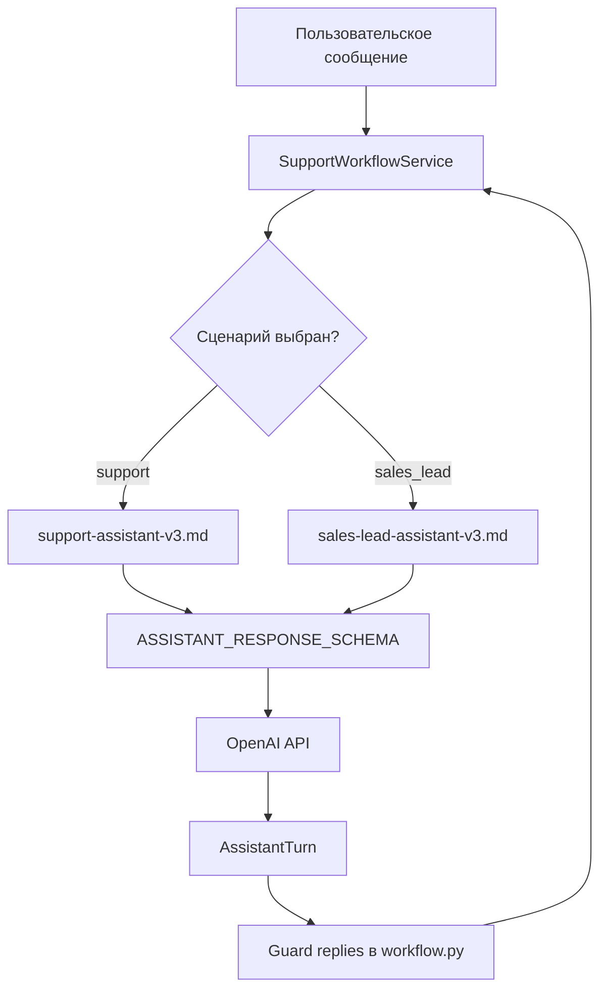

# 📝 Telegram Intake Bot · PROMPT_ARCHITECTURE

**Проект:** telegram-intake-bot  
**Активная версия промптов:** v3  
**Дата актуализации:** 2026-08-22  
**Статус:** as-built

---

## 🎯 1. Назначение

Документ фиксирует архитектуру промптов, используемых LLM-ассистентом Telegram Intake Bot. Промпты хранятся в `prompts/` в виде версионированных Markdown-файлов и загружаются кодом из `services/assistant/prompts.py`.

---

## 🧩 2. Структура запроса к LLM



---

## 📂 3. Хранение и версионирование промптов

| Файл | Версия | Статус | Описание |
|------|--------|--------|----------|
| [📄 `prompts/support-assistant-v1.md`](../prompts/support-assistant-v1.md) | v1 | Устаревшая | Исходный промпт техподдержки |
| [📄 `prompts/support-assistant-v2.md`](../prompts/support-assistant-v2.md) | v2 | Устаревшая | Промпт техподдержки с исправлениями |
| [📄 `prompts/support-assistant-v3.md`](../prompts/support-assistant-v3.md) | v3 | **Активная** | Упрощённый промпт техподдержки |
| [📄 `prompts/sales-lead-assistant-v1.md`](../prompts/sales-lead-assistant-v1.md) | v1 | Устаревшая | Исходный промпт сбора лидов |
| [📄 `prompts/sales-lead-assistant-v2.md`](../prompts/sales-lead-assistant-v2.md) | v2 | Устаревшая | Промпт сбора лидов с исправлениями |
| [📄 `prompts/sales-lead-assistant-v3.md`](../prompts/sales-lead-assistant-v3.md) | v3 | **Активная** | Упрощённый промпт сбора лидов |

### Правило изменений

1. Новая версия — новый файл.
2. Предыдущая версия сохраняется.
3. В этом документе добавляется запись в changelog.
4. После изменения выполняется E2E-прогон и фиксируются результаты в [🧪 `docs/TESTING.md`](TESTING.md).

---

## 🤖 4. support-assistant-v3

**Файл:** [📄 `prompts/support-assistant-v3.md`](../prompts/support-assistant-v3.md)

**Роль:** AI-ассистент первой линии техподдержки в Telegram.

**Изменения по сравнению с v2:**

- Все правила сведены к одному чёткому порядку сбора полей.
- Убрано дублирование инструкций про контакт, имя и location.
- Запреты заменены позитивными командами.
- Сохранена совместимость с guard-слоем в `services/workflow.py`.

### Обязательные поля (`extracted_ticket`)

| Поле | Описание |
|------|----------|
| `name` | Имя клиента |
| `contact` | Телефон или Telegram, явно названный в диалоге |
| `problem_summary` | Что случилось |
| `occurred_at` | Когда началась проблема |
| `location` | Где проявляется проблема |
| `priority` | `срочно` / `средне` / `низкий приоритет` |

### Ключевые правила

- Имя берётся **только** из сообщений пользователя, не из Telegram-профиля.
- Контакт заполняется **только** если пользователь явно назвал телефон или Telegram в диалоге.
- Telegram username из профиля **не** подходит как contact.
- После имени обязательно спрашивается контакт.
- Вопрос о проблеме формулируется как: «Какая у вас возникла проблема?»
- `ready_to_submit=true` только при заполненных всех шести полях.
- Пока `ready_to_submit=false`, бот не говорит, что заявка уже отправлена.

---

## 🤖 5. sales-lead-assistant-v3

**Файл:** [📄 `prompts/sales-lead-assistant-v3.md`](../prompts/sales-lead-assistant-v3.md)

**Роль:** AI-ассистент по сбору заявок для отдела продаж в Telegram.

**Изменения по сравнению с v2:**

- Убрано дублирование правил про company и status.
- Упрощён порядок: имя → контакт → компания → услуга → бюджет → сроки → статус.
- Status по-прежнему определяется автоматически; guard reply подстраховует, если LLM всё же запросит ручной выбор.

### Обязательные поля (`extracted_lead`)

| Поле | Описание |
|------|----------|
| `name` | Имя клиента |
| `contact` | Телефон или Telegram, явно названный в диалоге |
| `service_interest` | Интересующая услуга/продукт |
| `budget_range` | Бюджет или диапазон |
| `timeframe` | Когда клиент готов начать |
| `status` | `горячий` / `теплый` / `холодный` |

### Дополнительное поле

| Поле | Описание |
|------|----------|
| `company` | Компания или ИП (может быть `null`) |

### Ключевые правила

- `company` запрашивается после контакта, но не блокирует отправку.
- `company` заполняется **только** если пользователь явно назвал компанию/ИП/ООО. Имя клиента не копируется в `company`.
- `status` определяется **автоматически** по срокам и бюджету. Бот не спрашивает пользователя «горячий или тёплый?».
- `ready_to_submit=true` только при заполненных всех обязательных полях.
- Пока `ready_to_submit=false`, бот не говорит, что заявка уже отправлена.

---

## 📐 6. Response Schema

В обоих сценариях используется единый `ASSISTANT_RESPONSE_SCHEMA`:

```json
{
  "name": "assistant_turn",
  "strict": true,
  "schema": {
    "type": "object",
    "properties": {
      "reply": { "type": "string" },
      "extracted_ticket": {
        "type": "object",
        "properties": {
          "name": { "type": ["string", "null"] },
          "contact": { "type": ["string", "null"] },
          "problem_summary": { "type": ["string", "null"] },
          "occurred_at": { "type": ["string", "null"] },
          "location": { "type": ["string", "null"] },
          "priority": {
            "type": ["string", "null"],
            "enum": ["срочно", "средне", "низкий приоритет", null]
          }
        },
        "required": ["name", "contact", "problem_summary", "occurred_at", "location", "priority"],
        "additionalProperties": false
      },
      "extracted_lead": {
        "type": "object",
        "properties": {
          "name": { "type": ["string", "null"] },
          "contact": { "type": ["string", "null"] },
          "company": { "type": ["string", "null"] },
          "service_interest": { "type": ["string", "null"] },
          "budget_range": { "type": ["string", "null"] },
          "timeframe": { "type": ["string", "null"] },
          "status": {
            "type": ["string", "null"],
            "enum": ["горячий", "теплый", "холодный", null]
          }
        },
        "required": ["name", "contact", "company", "service_interest", "budget_range", "timeframe", "status"],
        "additionalProperties": false
      },
      "ready_to_submit": { "type": "boolean" }
    },
    "required": ["reply", "extracted_ticket", "extracted_lead", "ready_to_submit"],
    "additionalProperties": false
  }
}
```

---

## 🛡️ 7. Guard replies в workflow.py

Поскольку LLM не всегда строго следует инструкциям, в `services/workflow.py` добавлены guard-ответы. Если после merge ответа LLM какое-то обязательное поле пусто, ответ бота переопределяется чётким вопросом по недостающему полю.

| Сценарий | Условие guard | Ответ бота |
|----------|---------------|------------|
| support | `name` пуст | «Подскажите, как к вам обращаться?» |
| support | `contact` пуст | «Оставьте, пожалуйста, контакт для связи: телефон или Telegram.» |
| support | `problem_summary` пуст | «Кратко опишите, пожалуйста, что случилось.» |
| support | `occurred_at` пуст | «Когда началась эта проблема?» |
| support | `location` пуст | «Где проявляется проблема: на сайте, в приложении, в функции или на устройстве?» |
| support | `priority` пуст | «Насколько это срочно: срочно, средне или низкий приоритет?» |
| sales_lead | `contact` пуст | «Оставьте, пожалуйста, контакт для связи: телефон или Telegram.» |
| sales_lead | `company` не задана | «Укажите, пожалуйста, название компании, или напишите «для себя».» |
| sales_lead | `service_interest` пуст | «Какая услуга или продукт вас интересует?» |
| sales_lead | `budget_range` пуст | «В каком диапазоне планируете бюджет?» |
| sales_lead | `timeframe` пуст | «Когда планируете начать?» |
| sales_lead | `status` пуст | «Уточните, пожалуйста: вы готовы начать сразу, сравниваете варианты или пока только изучаете?» |

---

## 🛡️ 8. Защита от типичных ошибок LLM

| Проблема | Решение в промпте | Решение в коде |
|----------|-------------------|----------------|
| LLM использует имя из Telegram-профиля | Правило «имя только из диалога» | Проверка `name` против `telegram_first_name`; сброс если не упоминалось |
| LLM использует Telegram username как contact | Правило «contact только из диалога» | Guard reply требует контакт; fallback username только перед отправкой |
| LLM обещает отправить заявку раньше времени | Правило «не говорить об отправке пока `ready_to_submit=false`» | Принудительная отправка, если объект полный, но `ready_to_submit=false` |
| LLM не собирает `location` для software-проблем | Правило «location берётся из problem_summary» | Fallback `_extract_location` распознаёт кассовое ПО, оплату и т.д. |
| LLM возвращает невалидный `priority`/`status` | `enum` в JSON Schema | Pydantic-валидация `AssistantTurn` |
| LLM копирует имя в `company` | Правило «не копируй имя в company» | Guard reply спрашивает компанию явно |
| LLM просит пользователя самооценить `status` | Правило «status определяй автоматически» | Guard reply не даёт выбрать статус вручную |

---

## 🔄 9. Fallback-логика

Если вызов OpenAI API не удался:

1. Определяется последний запрошенный ботом параметр (`_detect_requested_field`, `_detect_sales_requested_field`).
2. Извлекаются имя, контакт, время, место/статус через regex.
3. Формируется следующий вопрос по недостающим полям.
4. Готовность к отправке проверяется через `is_complete()`.

Fallback не заменяет LLM полностью, но позволяет не обрывать диалог при временных сбоях API.

---

## 📁 10. Расположение в коде

| Артефакт | Файл |
|----------|------|
| Версионированные промпты | `prompts/*.md` |
| Загрузка промптов | `services/assistant/prompts.py` |
| JSON Schema | `services/assistant/prompts.py` (`ASSISTANT_RESPONSE_SCHEMA`) |
| Вызов LLM и защита от ошибок | `services/assistant/openai_support_assistant.py` |
| Guard replies и оркестрация | `services/workflow.py` |
| Fallback-логика | `services/assistant/openai_support_assistant.py` |

---

## 📊 12. Сравнение v2 и v3

### 12.1. Методология

Сравнение проводится по объективным инженерным метрикам, которые можно измерить без вызова LLM:

| Метрика | Почему важна |
|---------|--------------|
| Размер промпта | Длинный промпт дороже в токенах и перегружает модель |
| Число правил | Много правел = высокая когнитивная нагрузка на LLM |
| Число отрицаний | LLM плохо выполняет запреты «не делай X» |
| Дублирование | Повторы одного правила увеличивают шум и риск конфликта |
| Чёткость порядка | Единый нумерованный flow лучше соблюдается моделью |

### 12.2. Результаты сравнения

| Параметр | support v2 | support v3 | sales v2 | sales v3 |
|----------|------------|------------|----------|----------|
| Символов в промпте | ~5 400 | ~1 850 | ~5 600 | ~2 050 |
| Правил (буллетов) | 18 | 7 | 17 | 8 |
| Отрицаний («не ...») | 12 | 3 | 9 | 2 |
| Дублируемых тем | 5 | 1 | 4 | 1 |
| Нумерованный порядок полей | Нет | Да | Нет | Да |

### 12.3. Ключевые улучшения v3

- **Убрано дублирование.** Например, правило про username в v2 повторялось 3 раза; в v3 — 1 раз.
- **Запреты заменены позитивными командами.** Вместо «Не используй имя из профиля» — «Имя бери только из текста пользователя».
- **Company больше не противоречив.** В v2 было «может быть null» и «обязательно спроси» одновременно; в v3 — «если не ответил или «для себя» — null».
- **Единый порядок полей.** v3 даёт один нумерованный список вместо двух разных блоков.

### 12.4. Вывод

v3 уменьшает размер промпта примерно в **2,7–3 раза**, сокращает число правил и убирает дублирование, сохраняя guard-совместимость и порядок сбора полей. Это снижает когнитивную нагрузку на модель и уменьшает риск конфликтующих инструкций.

**Важно:** по качеству диалога v3 показывает **паритет с v2** — все тестовые сценарии собираются и отправляются одинаково корректно. Улучшение v3 — не в новых функциональных возможностях, а в инженерных метриках:

- **Экономия токенов** — каждый запрос к LLM становится дешевле.
- **Сопровождаемость** — проще править один чёткий промпт, чем 5–6 дублирующих друг друга блоков.
- **Надёжность архитектуры** — чем меньше логики завязано на промпт, тем больше можно доверить deterministic guard/fallback в коде.

> Окончательная проверка качества диалога выполняется сравнительным LLM-прогоном; результаты — в [🧪 `docs/TESTING.md`](TESTING.md) §7.6.

## 📜 13. История изменений

| Дата | Версия | Изменения |
|------|--------|-----------|
| 2026-08-09 | v1 | Первоначальные промпты `support-assistant-v1.md` и `sales-lead-assistant-v1.md`. |
| 2026-08-09 | v2 | Исправлены найденные в E2E-прогоне проблемы: контакт спрашивается явно, username не используется как contact, компания не копируется из имени, status определяется автоматически. Добавлены guard replies в `workflow.py`. |
| 2026-08-22 | v3 | Упрощены и структурированы промпты: убрано дублирование, запреты заменены позитивными командами, сохранён порядок полей и совместимость с guard-слоем. В коде переключены на v3. |

---

## 📚 Связанные документы

- [🏠 `README.md`](../README.md) — главная страница проекта.
- [🔌 `docs/API_CONTRACT.md`](API_CONTRACT.md) — контракты с Telegram Bot API и OpenAI API.
- [🏗️ `docs/ARCHITECTURE.md`](ARCHITECTURE.md) — общая архитектура системы.
- [📋 `docs/IMPLEMENTATION_PLAN.md`](IMPLEMENTATION_PLAN.md) — план реализации и критерии готовности.
- [🧪 `docs/TESTING.md`](TESTING.md) — результаты E2E-прогонов.
- [📊 `docs/PROJECT_STATE.md`](PROJECT_STATE.md) — паспорт состояния проекта.
