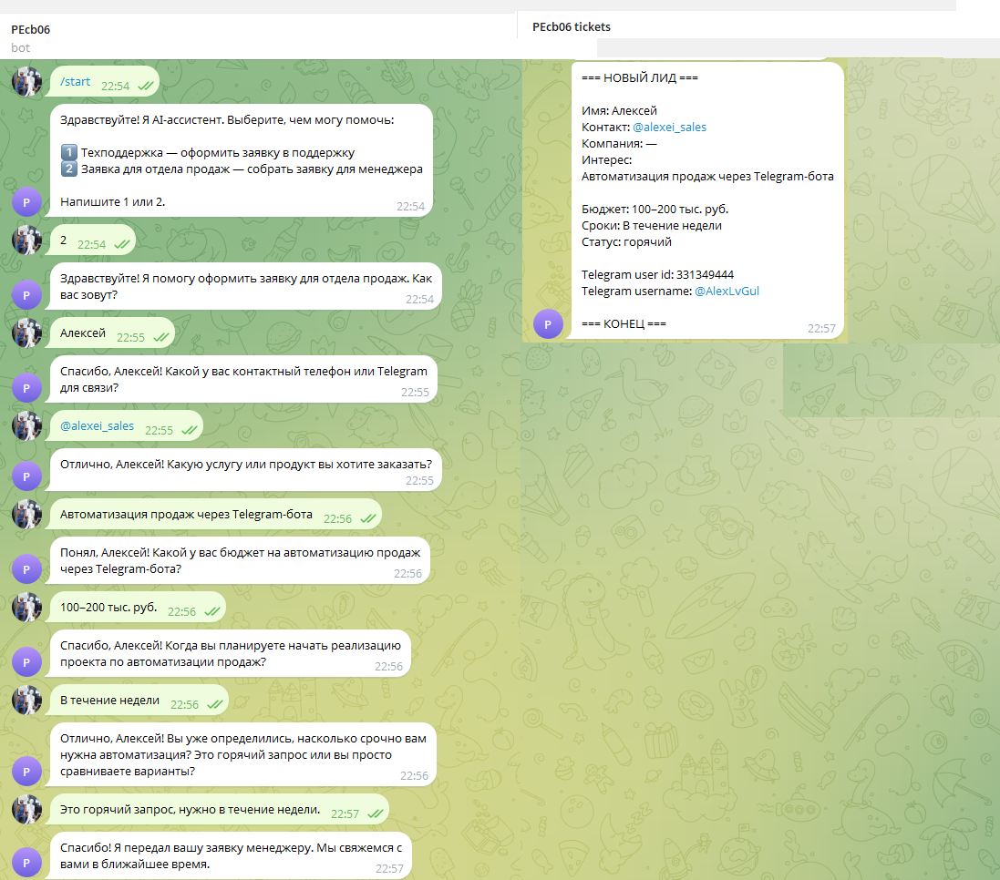
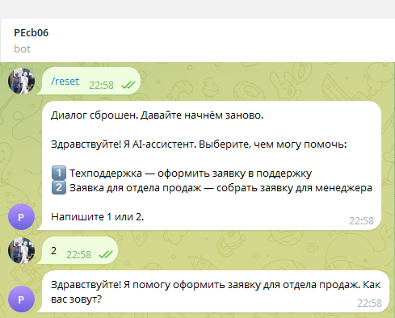

# 📖 Telegram Intake Bot · USER_GUIDE

**Проект:** telegram-intake-bot  
**Дата:** 2026-08-09  
**Статус:** as-built

---

## 🎓 1. Что такое Telegram Intake Bot

Telegram-бот, который помогает клиенту оформить заявку или оставить заявку для отдела продаж прямо в Telegram. Бот ведёт короткий диалог, уточняет недостающие данные и передаёт готовую заявку специалисту.

Бот не требует заполнения форм и не заменяет живого оператора: он собирает первичную информацию, чтобы менеджер или техподдержка могли быстро взять дело в работу.

---

## 🚀 2. Как начать

1. Найдите бота в Telegram или перейдите по прямой ссылке.
2. Отправьте команду `/start`.
3. Выберите направление:
   - `1` — Техподдержка
   - `2` — Заявка для отдела продаж

---

## 💬 3. Сценарий «Техподдержка»

Бот последовательно уточнит:

| # | Вопрос | Пример ответа |
|---|--------|---------------|
| 1 | Как вас зовут? | `Александр` |
| 2 | Контакт для связи. | `+79991234567` или `@username` |
| 3 | Что случилось? | `Не включается ноутбук после обновления` |
| 4 | Когда возникла проблема? | `Сегодня утром` |
| 5 | Где проявляется? | `На ноутбуке` |
| 6 | Насколько это срочно? | `срочно`, `средне` или `низкий приоритет` |

После этого заявка уйдёт специалисту.

---

## 💬 4. Сценарий «Заявка для продаж»

Бот последовательно уточнит:

| # | Вопрос | Пример ответа |
|---|--------|---------------|
| 1 | Как вас зовут? | `Алексей` |
| 2 | Контакт для связи. | `+79991234567` или `@username` |
| 3 | Компания (можно написать «для себя»). | `ООО Ромашка` |
| 4 | Какая услуга или продукт интересует? | `Автоматизация продаж через Telegram-бота` |
| 5 | В каком диапазоне бюджет? | `100–200 тыс. руб.` |
| 6 | Когда планируете начать? | `В течение недели` |

После этого заявка уйдёт менеджеру. Статус лида (`горячий`, `теплый`, `холодный`) определяется автоматически по срокам и бюджету.

---

## 🔄 5. Как сбросить диалог

Отправьте `/reset` — бот начнёт сбор заявки заново.

---

## ⚠️ 6. Ограничения

- Отвечайте текстом. Голосовые сообщения, фото и файлы пока не поддерживаются.
- Бот не использует ваше имя из профиля Telegram — укажите имя явно.
- Если бот не понял ответ, он переспросит. Попробуйте ответить короче и точнее.

---

## 📚 Связанные документы

- [🏠 `README.md`](../README.md) — главная страница проекта.
- [🎬 `docs/SYSTEM_DEMO.md`](SYSTEM_DEMO.md) — скриншоты и примеры диалогов.
- [🎬 `docs/E2E_SCENARIOS.md`](E2E_SCENARIOS.md) — сквозные сценарии и чек-лист скриншотов.
- [🎛️ `docs/OPERATOR_GUIDE.md`](OPERATOR_GUIDE.md) — как работать с заявками в чате операторов.
